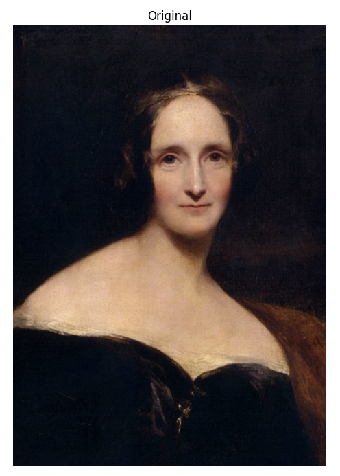
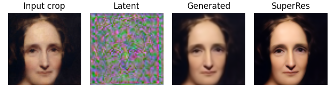
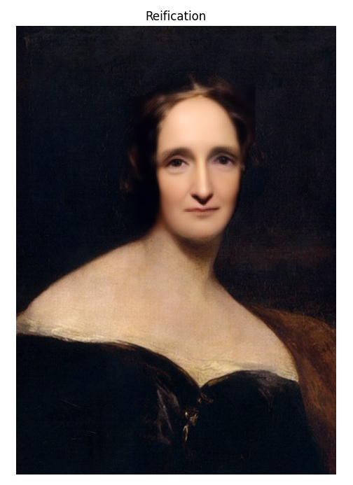

# Portrait Reification
### Transforming a portrait into a real face with diffusion models ###

In this repo you may find an application for the transformation of a painter’s portrait into a real human face; we call this process **portrait reification**. 

  
  <em>Reification of the portrait of Marie Antoinette by Martin van Meytens (1767)</em>

The heart of the application is the embedding procedure for generative diffusion models recently
introduced in [Image Embedding for Denoising Generative Models](https://arxiv.org/abs/2301.07485). Since the diffusion model was 
trained to generate human faces, it will revert the embedding
of the portrait into the most likely real approximation of the original subject. 

In order to turn this simple idea into a stand-alone and fully functional application, 
several steps have been required, both during preprocessing and postprocessing. The overall pipeline is described in the following picture.

  <table>
  <tr>
    <td width="20%"></td>
    <td></td>
    <td width="20%"></td>
  </tr>
  </table>
  <em>Reification pipeline over the portrait of Mary Shelley by Richard Rothwell, c. 1831-1840.
  </em>

From the input image on the left we automatically identify the face and extract a crop aligned accordingly to
the training data of the diffusion model. The crop is 
embedded in the latent space using our embedding network,
and the latent encoding is passed as input to the reverse diffusion process. The generated image is further processed
by a Super-resolution netwotk. Before reinserting it into
the original portrait, the crop is color adjusted and alpha-smoothed around the borders.
