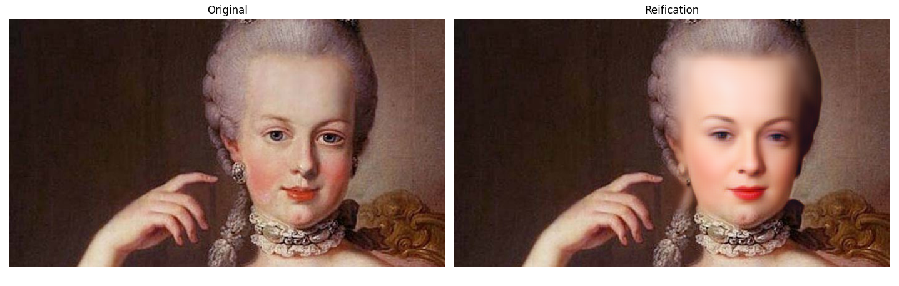

# Portrait Reification
### Transforming a portrait into a real face with diffusion models ###

In this repo you may find an application for the transformation of a painter’s portrait into a real human face; we call this process **portrait reification**. 

The heart of the application is the embedding procedure for generative diffusion models recently
introduced in [Image Embedding for Denoising Generative Models](https://arxiv.org/abs/2301.07485). Since the diffusion model was 
trained to generate human faces, it will revert the embedding
of the portrait into the most likely real approximation of the original subject. 

In order to turn this simple
idea into a stand-alone and fully functional application, 
several steps have been required, both during preprocessing 
and postprocessing. 
